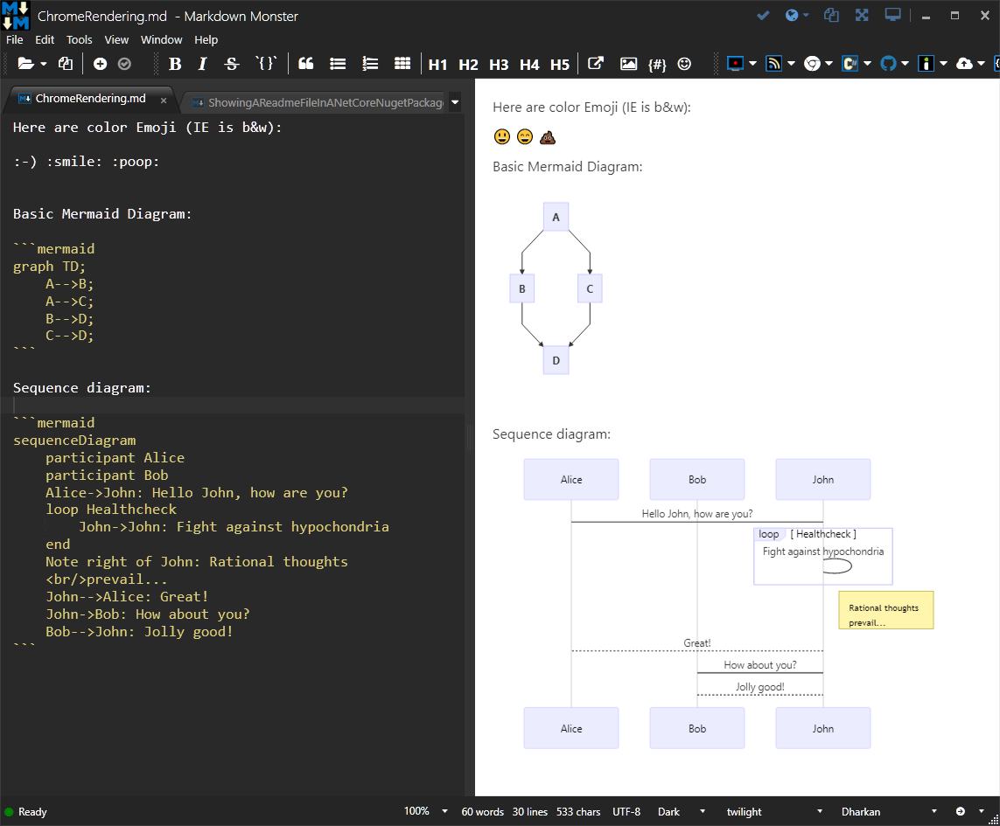

# Chromium Previewer Markdown Monster Addin
#### Addin to allow previewing of HTML using Chromium rather than the default IE Previewer

This addin replaces the default Internet Explorer based previews for the internal previewer as well as the separate external preview window. 

Markdown Monster by default uses the Internet Explorer Web Browser control for previews, and while most HTML features work, some Markdown support features like Mermaid, nonoml and a few other extensions don't work in the default preview. Using this previewer allows full fidelity previews using the same engine that Chrome uses.

Here's a screenshot of a few features that would not work in the IE based control.

